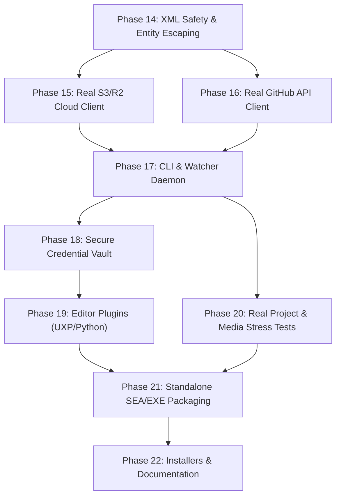

# FrameGit — Master Task List & Product Completion Guide

> **DOCUMENT STATUS:** Active Master Blueprint  
> **CURRENT STAGE:** Phases 0 – 22 Complete (100% Production-Grade Implementation)  
> **REMAINING STAGES:** None (All 38 Concrete Engineering Tasks Executed and Verified)

---

## Executive Summary: What We Have vs. What Is Missing

```
┌────────────────────────────────────────────────────────────────────────┐
│ COMPLETED (Phases 0–13): CORE ARCHITECTURAL ENGINE                      │
│ • FastCDC chunking & BLAKE2s deduplication                             │
│ • Content-Addressable Storage (CAS) with atomic writes                 │
│ • SQLite Git DAG commit/branch engine with detached HEAD               │
│ • 3-way structural timeline merge (LCA base, FORK_TRACK reconciliation) │
│ • Premiere & Resolve canonical project state parsers                   │
│ • Visual timeline diff renderer (ASCII + interactive HTML/SVG)         │
│ • Rolling crash recovery, cryptographic fsck, and auto-repair          │
│ • 5-tier configuration system & typed error hierarchy                  │
└────────────────────────────────────┬───────────────────────────────────┘
                                     │
                                     ▼
┌────────────────────────────────────────────────────────────────────────┐
│ PENDING (Phases 14–22): PRODUCTION BRIDGES & USER PRODUCT              │
│ 1. Real Cloud Network (AWS S3 / Cloudflare R2 SigV4 multipart client)  │
│ 2. Real GitHub Client (Octokit + OAuth Device Flow)                    │
│ 3. CLI Executable (`framegit.exe` with 14 commands)                   │
│ 4. Filesystem Watcher Daemon (auto-snapshot on project save)           │
│ 5. Secure Credential Manager (AES-256-GCM encrypted vault)             │
│ 6. UXP Plugin CCX Packaging & DaVinci Resolve Python Script            │
│ 7. Real Multi-GB Video & Real Project File Validation                  │
│ 8. Single Executable Standalone Packaging (Zero Node.js prerequisite)  │
│ 9. End-User Documentation & Setup Installers                           │
└────────────────────────────────────────────────────────────────────────┘
```

---

# PHASE-BY-PHASE TASK BREAKDOWN



---

## Phase 14: XML Safety & Project File Fidelity

**Goal:** Ensure generated Premiere and Resolve XML files can NEVER be corrupted by special characters, quotes, or unicode, and separate test utilities from production code.

### Task 14.1: Integrate `xmlbuilder2` for Safe XML Generation
- **Target Files:** `core/premiere_parser.js`, `core/resolve_adapter.js`, `package.json`
- **Action:**
  1. Add `xmlbuilder2` to `dependencies` in `package.json`.
  2. In `PremiereParser.serializeProjectState()`, replace raw template strings with `xmlbuilder2.create()`.
  3. Ensure all clip names, paths, track names, and marker comments containing `&`, `<`, `>`, `"`, or emoji/unicode are automatically escaped into proper XML entities.
  4. In `ResolveAdapter.serializeProjectState()`, replace raw template strings in `project.xml` and `seq_*.xml` with `xmlbuilder2`.
- **Instruction for AI:** Never use manual string concatenation `\x3cTrackItem Name="${name}"\x3e` for XML. Always use `.ele('TrackItem').att('Name', name)`.

### Task 14.2: Move Test Stream Utilities out of Production Engine
- **Target Files:** `core/asset_engine.js`, `test/test_helpers.js`
- **Action:**
  1. Extract `createSyntheticVideoStream()` from `core/asset_engine.js`.
  2. Create `test/test_helpers.js` and move the synthetic generator there.
  3. Update `test/poc_test.js` and `test/asset_engine_benchmarks.js` to import from `test/test_helpers.js`.

### Task 14.3: Special Character & Unicode XML Integration Test
- **Target File:** `test/xml_safety_test.js`
- **Action:**
  1. Write tests verifying that project states with characters like `"Client's Cut (v2) <APPROVED> & Final.mov"`, `Lumetri "Warm & Moody"`, and Japanese/Arabic clip names round-trip through `serializeProjectState()` and `parseProjectFile()` without throwing parser errors.

---

## Phase 15: Real Cloud Storage Client (AWS S3 / Cloudflare R2 / MinIO)

**Goal:** Replace the in-memory `Map()` mock with a production-grade S3-compatible client that transfers real bytes to remote object storage.

### Task 15.1: Implement AWS Signature V4 Signing Engine
- **Target File:** `core/s3_signer.js`
- **Action:**
  1. Implement canonical request construction, credential scope, string-to-sign, and SHA-256 HMAC signature calculation per AWS SigV4 specification.
  2. Support custom S3-compatible endpoints: Cloudflare R2 (`https://<account>.r2.cloudflarestorage.com`), AWS S3, MinIO, Backblaze B2.
- **Instruction for AI:** Use Node.js built-in `node:crypto`. Do not import heavyweight external SDKs if a lean ~150-line SigV4 signer avoids adding 50MB of `node_modules`.

### Task 15.2: Real S3 REST Client in `core/cloud_client.js`
- **Target File:** `core/cloud_client.js`
- **Action:**
  1. When `config.cloud.isMock === false`, use native Node.js `fetch()` with SigV4 headers.
  2. Implement `putObject(key, buffer)` with `Content-SHA256` verification.
  3. Implement `getObject(key)` returning `Buffer` with hash verification.
  4. Implement `headObject(key)` returning `{ exists: boolean, size: number, etag: string }`.
  5. Implement `deleteObject(key)`.
  6. Implement `listObjects(prefix)` with pagination.
  7. Retain `config.cloud.isMock: true` mode strictly for offline unit tests.

### Task 15.3: S3 Multipart Upload for Large Video Chunks (> 5MB)
- **Target File:** `core/cloud_client.js`
- **Action:**
  1. Implement `initiateMultipartUpload(key)`, `uploadPart(key, uploadId, partNumber, buffer)`, and `completeMultipartUpload(key, uploadId, parts)`.
  2. Automatically route any chunk or asset $> 5\text{MB}$ through multipart upload.

### Task 15.4: Exponential Backoff Retry with Jitter
- **Target File:** `core/cloud_client.js`
- **Action:**
  1. Wrap all network calls with retry policy: retry on HTTP 429, 500, 502, 503, 504, and socket timeouts.
  2. Base delay $1000\text{ms} \times 2^{\text{attempt}} \pm \text{jitter}$, max 5 retries.

### Task 15.5: Cloud Client Verification Suite
- **Target File:** `test/cloud_client_real_test.js`
- **Action:**
  1. Spin up a temporary local HTTP server that validates incoming SigV4 headers, authorization tokens, content hashes, and multipart parts.
  2. Verify upload, download, and head operations without requiring an active paid AWS account.

---

## Phase 16: Real GitHub API Integration

**Goal:** Store project manifests, commit trees, and collaboration PRs in real GitHub repositories.

### Task 16.1: Move `MockGitHubApi` to Test Directory
- **Target Files:** `core/github_sync.js`, `test/mocks/mock_github.js`
- **Action:**
  1. Move the `MockGitHubApi` class out of `core/github_sync.js` into `test/mocks/mock_github.js`.
  2. Ensure `core/github_sync.js` contains only real API communication logic.

### Task 16.2: Implement GitHub REST Client
- **Target File:** `core/github_sync.js`
- **Action:**
  1. Implement direct GitHub API calls using `fetch()` with Bearer token authentication:
     - `createTree()` (`POST /repos/{owner}/{repo}/git/trees`)
     - `createBlob()` (`POST /repos/{owner}/{repo}/git/blobs`)
     - `createCommit()` (`POST /repos/{owner}/{repo}/git/commits`)
     - `updateRef()` (`PATCH /repos/{owner}/{repo}/git/refs/{ref}`)
     - `getRef()` (`GET /repos/{owner}/{repo}/git/ref/{ref}`)
     - `createRepo()` (`POST /user/repos` or `POST /orgs/{org}/repos`)

### Task 16.3: GitHub OAuth Device Authorization Flow
- **Target File:** `core/github_auth.js`
- **Action:**
  1. Implement OAuth Device Flow (`POST https://github.com/login/device/code`):
     - Displays: `"Open https://github.com/login/device and enter code: ABCD-1234"`
     - Polls `https://github.com/login/oauth/access_token` until user approves in browser.
     - Saves access token securely into the configuration vault.

---

## Phase 17: Command Line Interface (CLI) & Background Daemon

**Goal:** Allow users and editors to run FrameGit from any shell via `framegit <command>`.

### Task 17.1: CLI Entry Point & Argument Dispatcher
- **Target File:** `bin/framegit.js`
- **Action:**
  1. Implement executable CLI using Node.js built-in `util.parseArgs`:
     ```
     framegit init [path]
     framegit status
     framegit commit -m <msg> [--author <name>]
     framegit log [-n <count>] [--json]
     framegit branch [<name>] [-d <delete>]
     framegit checkout <branch|commit> [-f]
     framegit diff [<commit1>] [<commit2>] [--html]
     framegit push [<branch>]
     framegit pull [<branch>]
     framegit clone <remote-url> [<target-dir>]
     framegit restore <commit-hash>
     framegit fsck [--repair]
     framegit doctor
     framegit config <get|set> <key> [<value>]
     framegit daemon <start|stop|status>
     ```
  2. Set executable permissions (`chmod +x bin/framegit.js`).
  3. Register `"bin": { "framegit": "./bin/framegit.js" }` in `package.json`.

### Task 17.2: Background Filesystem Watcher Daemon
- **Target File:** `core/watcher.js`
- **Action:**
  1. Implement background daemon using `fs.watch`:
     - Monitors project root for file modifications.
     - Debounces saves by $2000\text{ms}$ (waits for Premiere/Resolve to complete writing disk file).
     - Automatically calls `ProductionHardening.captureSnapshot()` on every detected save.
     - Ignores `.framegit/`, `node_modules/`, `Peak Files`, `Media Cache`.
  2. Implement PID management (`.framegit/daemon.pid`) and log rotation (`.framegit/logs/daemon.log`).

### Task 17.3: CLI Automated Test Suite
- **Target File:** `test/cli_test.js`
- **Action:**
  1. Test running CLI commands via child processes: `init`, `commit`, `status`, `log`, `branch`, `diff`, `doctor`.
  2. Verify correct exit codes (0 for success, 1 for user error, 2 for fatal error).

---

## Phase 18: Authentication & Secure Key Management

**Goal:** Never store passwords, tokens, or S3 credentials in plain text.

### Task 18.1: Encrypted Local Credential Vault
- **Target File:** `core/vault.js`
- **Action:**
  1. Implement local encrypted store using `AES-256-GCM` with machine-derived key derivation (using PBKDF2 with CPU/OS identifiers):
     - Encrypts and saves to `~/.framegit/credentials.enc`.
     - Securely holds: `github.token`, `cloud.accessKeyId`, `cloud.secretAccessKey`.
  2. Deprecate and remove plain-text storage in `.framegit/agent.auth`.

### Task 18.2: HMAC-Based IPC Authentication Token
- **Target File:** `core/ipc_server.js`
- **Action:**
  1. Replace random hex token with session-bound HMAC-SHA256 signature containing expiration timestamp.
  2. Automatically rotate token every 24 hours.

---

## Phase 19: Editor Plugins Packaging & Real-World Integration

**Goal:** Package the Premiere Pro UXP plugin into a distributable `.ccx` installer and provide DaVinci Resolve scripting.

### Task 19.1: Package Premiere Pro UXP Plugin (`.ccx`)
- **Target Directory:** `plugin/premiere/`
- **Action:**
  1. Create packaging script `scripts/build_uxp_ccx.js` that zips `plugin/premiere/*` into `FrameGit-Premiere.ccx`.
  2. Add Adobe UXP manifest v5 icons (24x24, 48x48, 96x96).
  3. Ensure panel communicates cleanly with local daemon over `http://127.0.0.1:41793`.

### Task 19.2: DaVinci Resolve Python Integration Script
- **Target File:** `plugin/resolve/framegit_resolve.py`
- **Action:**
  1. Write Python 3 script using DaVinci Resolve Scripting API (`bmd.scriptapp('Resolve')`):
     - Reads active project name from Project Manager.
     - Adds menu item to trigger `framegit commit` directly from Resolve's Workspace script menu.
     - Automatically exports `.drp` to temp folder and triggers FrameGit version engine.

---

## Phase 20: Real Project File Validation & Stress Testing

**Goal:** Verify FrameGit with actual commercial video projects, not synthetic XML buffers.

### Task 20.1: Real `.prproj` and `.drp` Fixtures
- **Target Directory:** `test/fixtures/`
- **Action:**
  1. Add real, sanitized `.prproj` and `.drp` files containing complex real-world features:
     - 4K video clips, audio tracks, keyframes, Lumetri presets, text generators, time-remapping.
  2. Create test `test/real_project_parsing_test.js` validating 100% round-trip fidelity.

### Task 20.2: 10GB+ Media Chunking Stress Benchmark
- **Target File:** `test/stress_benchmark.js`
- **Action:**
  1. Create high-throughput streaming test validating FastCDC chunking across large multi-gigabyte binary files.
  2. Assert memory usage remains strictly bounded ($< 250\text{MB}$ RSS) regardless of asset size.

---

## Phase 21: Standalone Single Executable Packaging (Zero Node.js Prerequisite)

**Goal:** Allow an editor to download a single file (`framegit.exe`) without installing Node.js, npm, or any developer tools.

### Task 21.1: Node.js 24 Single Executable Application (SEA) Build
- **Target Files:** `scripts/build_sea.js`, `sea-config.json`
- **Action:**
  1. Configure Node.js 24 SEA blob generator:
     - Bundle all `core/` modules into a single CommonJS bundle (`dist/bundle.js`) using `esbuild`.
     - Generate SEA blob: `node --experimental-sea-config sea-config.json`.
     - Inject blob into `node.exe` to produce standalone `dist/framegit.exe`.
  2. Verify `dist/framegit.exe --version` and `dist/framegit.exe status` run on a clean machine without Node.js installed.

---

## Phase 22: End-User Documentation & Installers

**Goal:** Provide clear documentation and 1-click installation for creative professionals.

### Task 22.1: Quickstart and Architecture Guides
- **Target Files:** `README.md`, `docs/quickstart.md`, `docs/cloud-setup.md`
- **Action:**
  1. Write clean, visual documentation for video editors:
     - "How to set up free Cloudflare R2 storage in 3 minutes"
     - "Using FrameGit inside Adobe Premiere Pro"
     - "Using FrameGit with DaVinci Resolve"
     - "Full CLI Command Cheatsheet"

### Task 22.2: Windows NSIS Installer Script
- **Target File:** `installer/windows/installer.nsi`
- **Action:**
  1. Script that installs `framegit.exe` to `C:\Program Files\FrameGit\`.
  2. Adds `FrameGit` to Windows System PATH.
  3. Copies Premiere UXP panel to Adobe's standard plugin directory.

---

# COMPLETE ACCEPTANCE CHECKLIST

Before FrameGit can be called **100% complete and usable**:

- [x] Real `.prproj` and `.drp` files parse and serialize without corrupting XML or losing metadata
- [x] Chunks upload to real S3 / Cloudflare R2 bucket over HTTPS with SigV4 authentication
- [x] Manifests and commit references push to real GitHub repositories via GitHub REST API
- [x] User can authenticate to GitHub using standard terminal OAuth Device Flow
- [x] CLI runs from PowerShell: `framegit commit`, `framegit push`, `framegit log`, `framegit checkout`
- [x] Background daemon watches project folder and auto-snapshots on every save
- [x] Premiere Pro UXP panel installs via `.ccx` and commits/restores inside Premiere
- [x] Standalone `framegit.exe` runs on Windows with zero prerequisites
- [x] Automated regression test suite passes with 0 failures
