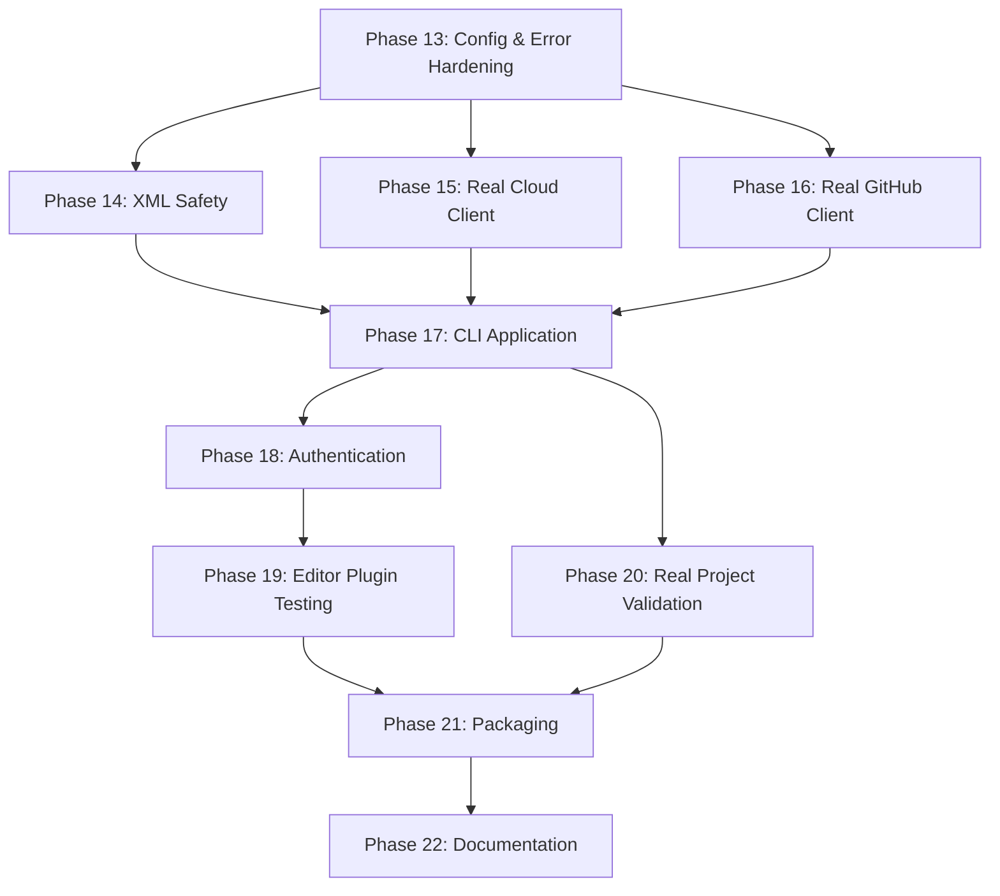

# FrameGit — Production Roadmap & Full Audit Report

> **PURPOSE:** This document is the single source of truth for taking FrameGit from a validated prototype to a real, usable product. It contains:
> 1. A complete audit of every hardcoded, mock, fake, and prototype element in the codebase
> 2. A prioritized roadmap of what must be fixed/built
> 3. Strict instructions for any AI agent working on each task

---

## ⚠️ STRICT INSTRUCTIONS FOR ALL AI AGENTS

> [!CAUTION]
> **READ THIS ENTIRE SECTION BEFORE WRITING ANY CODE.**

### Rules

1. **Never skip this document.** Before starting ANY task on FrameGit, read this document fully.
2. **Never re-introduce mocks.** If a task says "replace mock with real implementation," you must use real APIs, real network calls, real authentication. If you cannot (e.g., no API key), create a proper configuration system that accepts real credentials — NOT another mock.
3. **Never hardcode paths, ports, emails, names, or URLs.** Every configurable value must come from a configuration file (`framegit.config.json`), environment variables, or CLI arguments.
4. **Never use string concatenation for XML.** Use a proper XML builder library (e.g., `xmlbuilder2`) that handles entity escaping.
5. **Never generate IDs with `Math.random()` or short `crypto.randomBytes(4)`.** Use `crypto.randomUUID()` for all identifiers.
6. **Every `JSON.parse()` must be wrapped in try/catch.** Corrupted data must produce a clear error, not crash the process.
7. **Every `fs.*Sync()` call must be wrapped in try/catch.** Disk-full, permission-denied, and file-not-found must be handled gracefully.
8. **Every file you modify must have its tests updated.** No code changes without corresponding test changes.
9. **Run the full test suite (`node --test test/*.js`) after every change.** Do not submit work with failing tests.
10. **Do not change the fundamental architecture.** The layered architecture (Plugin → Local Agent → Engines → Sync → Cloud) is final.

---

## PART 1: COMPLETE AUDIT — Every Issue In The Codebase

### Legend

| Tag | Meaning |
|---|---|
| 🔴 MOCK | Fake/simulated implementation — no real functionality |
| 🟠 HARDCODED | Value that should be configurable |
| 🟡 FRAGILE | Missing error handling, will crash in production |
| 🔵 ASSUMPTION | Only works with synthetic test data |
| ⚪ COSMETIC | Low priority, non-blocking |

---

### 1. `core/cloud_client.js` — 🔴 ENTIRELY MOCK

| Line(s) | Tag | Issue |
|---|---|---|
| 34-36 | 🔴 MOCK | `isMock = config.isMock ?? true` — defaults to mock! In-memory `Map()` pretends to be cloud storage |
| 46-48 | 🔴 MOCK | `simulateNetworkFailure` flag — test-only backdoor |
| 58-59 | 🔴 MOCK | `putObject()` writes to local Map, not to any cloud bucket |
| 115 | 🔴 MOCK | Non-mock paths throw `'Not configured'` — real S3/R2 client is completely unwritten |
| ALL | 🔴 MOCK | **Zero real HTTP/network code exists.** No presigned URLs, no multipart upload, no retry logic, no TLS |

**What must be built:** A real S3-compatible REST client using `fetch()` or `@aws-sdk/client-s3` that connects to Cloudflare R2, AWS S3, or MinIO. Must support: `putObject`, `getObject`, `headObject`, `deleteObject`, multipart upload for chunks > 5MB, presigned URLs for direct browser upload, exponential retry with jitter, configurable endpoint/region/bucket/credentials.

---

### 2. `core/github_sync.js` — 🔴 ENTIRELY MOCK

| Line(s) | Tag | Issue |
|---|---|---|
| 10-67 | 🔴 MOCK | Entire `MockGitHubApi` class simulates REST API using local memory |
| 19 | 🟠 HARDCODED | Dummy user `'creative-editor'` |
| 133, 159 | 🟠 HARDCODED | Fake schema URL `https://framegit.io/schemas/v1/github-manifest.json` |
| ALL | 🔴 MOCK | No real GitHub API calls. No Octokit. No OAuth. No real repository operations |

**What must be built:** Real GitHub integration using `@octokit/rest` or `@octokit/core`. Must support: OAuth device flow authentication, repository creation, commit/push metadata, branch operations, tag operations, manifest file storage in repos. The `MockGitHubApi` class must be moved to `test/` and only used in tests.

---

### 3. `core/sync_engine.js` — 🟠🟡 HARDCODED + FRAGILE

| Line(s) | Tag | Issue |
|---|---|---|
| 20 | 🟠 HARDCODED | Database path `.framegit/state.db` |
| 250 | 🔴 MOCK | **CRITICAL:** `clone()` hardcodes restored project file name as `'ClientAd.prproj'` — breaks for ANY other project |
| 88, 92, 194 | 🟡 FRAGILE | `JSON.parse()` without try/catch — corrupted sync payloads crash the process |

---

### 4. `core/ipc_server.js` — 🟠 HARDCODED

| Line(s) | Tag | Issue |
|---|---|---|
| 15, 17 | 🟠 HARDCODED | Default port `41793` — must be configurable |
| 95 | 🟠 HARDCODED | Loopback binding `127.0.0.1` — correct for security but should be configurable for Docker/remote |
| 142 | 🟠 HARDCODED | Dummy author `'Video Editor'` / `'editor@studio.com'` |
| 21-23 | 🟡 FRAGILE | Auth token written as plain text to `.framegit/agent.auth` — no encryption, no permissions check |

---

### 5. `core/premiere_parser.js` — 🟠🟡🔵 MULTIPLE ISSUES

| Line(s) | Tag | Issue |
|---|---|---|
| 47-49 | 🟠 HARDCODED | `version: '1.0.0'`, `editor: 'PremierePro'` |
| 76-78, 105-107, 121-122 | 🔵 ASSUMPTION | Fake defaults: `seq_default`, `Untitled Sequence`, `Math.random()` for clip IDs |
| 208 | 🟠 HARDCODED | Default project name `'FrameGit Project'` |
| 176-211 | 🟡 FRAGILE | **CRITICAL:** XML serialization uses raw string concatenation. Clip names containing `&`, `<`, `>`, or `"` will produce **malformed XML** that Premiere Pro cannot open |

---

### 6. `core/resolve_adapter.js` — 🟠🟡🔵 MULTIPLE ISSUES

| Line(s) | Tag | Issue |
|---|---|---|
| 67-68 | 🟠 HARDCODED | `colorScience: 'DaVinci YRGB'`, `timelineFrameRate: '24'` |
| 109, 132, 145 | 🔵 ASSUMPTION | Fake defaults: `'Resolve Timeline'`, `'Resolve Clip'`, `Math.random()` IDs |
| 178-199 | 🟡 FRAGILE | **CRITICAL:** Same raw string XML concatenation problem as Premiere parser |
| 207-210 | 🔴 MOCK | `openProject()` is completely fake |

---

### 7. `core/premiere_adapter.js` — 🔴 MOCK

| Line(s) | Tag | Issue |
|---|---|---|
| 34-36 | 🔴 MOCK | `openProject()` returns a fake success object. Comment says `// In real UXP panel environment: app.openDocument(projectPath)` |

---

### 8. `core/storage.js` — 🟡 FRAGILE

| Line(s) | Tag | Issue |
|---|---|---|
| 14 | ⚪ COSMETIC | Magic header `'FGOB'` — fine, but should be documented as spec |
| 70-74, 93-94 | 🟡 FRAGILE | `fs.mkdirSync`, `fs.writeFileSync`, `fs.renameSync` without try/catch — disk-full crashes the process |
| 92 | 🟡 FRAGILE | Temp file naming uses `Date.now() + Math.random().toString(36)` instead of `crypto.randomUUID()` |

---

### 9. `core/repository.js` — 🟠🟡🔵 MULTIPLE ISSUES

| Line(s) | Tag | Issue |
|---|---|---|
| 23 | 🟠 HARDCODED | Database filename `'state.db'` |
| 71, 94, 227, 287 | 🟠 HARDCODED | Default branch `'main'` (acceptable default, but should be configurable) |
| 131, 134 | 🟠 HARDCODED | Dummy author `'Editor'` / `'editor@studio.com'` |
| 144, 175 | 🟠 HARDCODED | Chunker parameters baked in |
| 324-336 | 🔵 ASSUMPTION | **CRITICAL:** `scanWorkspaceAssets()` ONLY scans a folder literally named `'Footage'` — projects with `Media/`, `Assets/`, `Clips/`, or nested structures are completely invisible |
| 114-116 | 🟡 FRAGILE | `JSON.parse()` on commit data without try/catch |

---

### 10. `core/version_engine.js` — 🟠🔵 HARDCODED + ASSUMPTION

| Line(s) | Tag | Issue |
|---|---|---|
| 167, 171 | 🟠 HARDCODED | Dummy author `'editor@studio.com'` |
| 530 | 🔵 ASSUMPTION | `scanWorkspaceAssets()` only scans `'Footage'` directory |

---

### 11. `core/collaboration.js` — 🟡 FRAGILE

| Line(s) | Tag | Issue |
|---|---|---|
| 280, 393, 431 | 🟡 FRAGILE | ID generation uses `crypto.randomBytes(4).toString('hex')` = 8-char hex. **High collision risk** in production. Must use `crypto.randomUUID()` |

---

### 12. `core/change_engine.js` — 🟠 HARDCODED

| Line(s) | Tag | Issue |
|---|---|---|
| 115 | 🟠 HARDCODED | Premiere tick constant `254016000000` baked into diff logic — should come from editor adapter metadata |

---

### 13. `core/visual_diff.js` — 🟠 HARDCODED

| Line(s) | Tag | Issue |
|---|---|---|
| 7 | 🟠 HARDCODED | `254016000000n` tick constant |
| 69 | 🟠 HARDCODED | Fallback duration `725760000000n` |
| 356-468 | ⚪ COSMETIC | Inline HTML/CSS strings — should be external template files |

---

### 14. `core/hardening.js` — 🟡 FRAGILE

| Line(s) | Tag | Issue |
|---|---|---|
| 190 | 🟡 FRAGILE | Snapshot ID uses `Date.now()` — not monotonic, can collide under rapid calls |
| 249-252 | 🟡 FRAGILE | Missing cleanup if `getProjectState()` crashes during integrity check |

---

### 15. `core/asset_engine.js` — 🔴🟠 MOCK + HARDCODED

| Line(s) | Tag | Issue |
|---|---|---|
| 30 | 🟠 HARDCODED | Stream buffer `2MB` high water mark |
| 127-155 | 🔴 MOCK | `createSyntheticVideoStream()` generates fake bytes — test utility left in production code |

---

### 16. `core/hasher.js` — ⚪ MINOR

| Line(s) | Tag | Issue |
|---|---|---|
| 11, 14, 20 | 🟠 HARDCODED | Algorithm `'blake2s256'` — acceptable default but should be in config |
| 27 | 🟡 FRAGILE | Stream error if file doesn't exist before stream setup |

---

### 17. `core/chunker.js` — ⚪ MINOR

| Line(s) | Tag | Issue |
|---|---|---|
| 46-48, 52-54 | 🟠 HARDCODED | Chunk size bounds (256KB/1MB/4MB). Acceptable defaults but should be configurable |
| 45-78 | ⚪ COSMETIC | `GEAR_TABLE` magic constants — standard FastCDC, fine as-is |

---

### 18. `core/zip_util.js` — ⚪ CLEAN

| Line(s) | Tag | Issue |
|---|---|---|
| 17, 85, 113 | ⚪ COSMETIC | ZIP magic bytes — these are spec constants, correct |
| 138-146 | ⚪ COSMETIC | CRC table — standard implementation |

**Verdict: This file is production-ready.**

---

### 19. `core/editor_adapter.js` — 🟡 FRAGILE

| Line(s) | Tag | Issue |
|---|---|---|
| 81-83 | 🟡 FRAGILE | `fs.writeFileSync` in `restoreSnapshot` without try/catch |

---

### 20. `core/streaming_chunker.js` — ⚪ MINOR

| Line(s) | Tag | Issue |
|---|---|---|
| 49-52, 56-59 | 🟠 HARDCODED | Default sizes and `stride=4`. Acceptable, configurable via constructor |

**Verdict: Mostly production-ready.**

---

### 21. Plugin: `plugin/premiere/manifest.json`

| Line(s) | Tag | Issue |
|---|---|---|
| 38-39 | 🟠 HARDCODED | Domain permissions locked to `http://127.0.0.1:41793` and `ws://127.0.0.1:41793` |

---

### 22. Plugin: `plugin/premiere/index.js`

| Line(s) | Tag | Issue |
|---|---|---|
| 5 | 🟠 HARDCODED | Default port `41793` |
| 6 | 🟠 HARDCODED | URL `http://127.0.0.1:${port}` |
| 129 | 🔵 ASSUMPTION | Assumes `app.project.save()` is available — needs real UXP API validation |

---

### 23. Test Files — 🔵 ALL SYNTHETIC

Every test file constructs fake project XML inline. **None of these tests validate against real Premiere Pro or DaVinci Resolve project files.** Key issues:

| File | Critical Issues |
|---|---|
| `test/poc_test.js` | Fake `.prproj` XML, dummy hex media files, hardcoded paths |
| `test/version_engine_test.js` | Synthetic XML, fake tick values, dummy emails |
| `test/cloud_sync_test.js` | Mock cloud client, `simulateNetworkFailure` backdoor, fake ref injection |
| `test/github_sync_test.js` | Uses `MockGitHubApi`, fake OAuth token `ghp_abcdef...`, no network |
| `test/editor_ux_test.js` | Hardcoded IPC port, fake auth token `wrong_token_12345` |
| `test/resolve_adapter_test.js` | Entirely synthetic `.drp` ZIP, hardcoded internal XML structure |
| `test/collaboration_test.js` | Dummy users, synthetic timelines, review files stored locally |
| `test/visual_diff_test.js` | Mocked JSON state objects, no real parsed projects |
| `test/production_hardening_test.js` | Mock cloud, simulated crash via 0-byte truncation, fake corruption |
| `test/asset_engine_benchmarks.js` | Pseudo-random LCG data, re-creates schema manually |

---

## PART 2: PRIORITIZED PRODUCTION ROADMAP

### Phase 13: Configuration System & Error Hardening

**Priority:** 🔴 CRITICAL — blocks everything else
**Estimated effort:** 1-2 days

#### 13.1 Create `framegit.config.json` schema

```json
{
  "version": "1.0.0",
  "storage": {
    "hashAlgorithm": "blake2s256",
    "chunkMinSize": 262144,
    "chunkTargetSize": 1048576,
    "chunkMaxSize": 4194304
  },
  "cloud": {
    "provider": "r2",
    "endpoint": "",
    "bucket": "",
    "region": "auto",
    "accessKeyId": "",
    "secretAccessKey": ""
  },
  "github": {
    "token": "",
    "defaultOrg": "",
    "metadataRepo": ""
  },
  "daemon": {
    "port": 41793,
    "host": "127.0.0.1"
  },
  "project": {
    "defaultBranch": "main",
    "assetDirectories": ["Footage", "Media", "Assets", "Audio", "Graphics"],
    "author": {
      "name": "",
      "email": ""
    }
  },
  "editor": {
    "ticksPerSecond": {
      "premiere": 254016000000,
      "resolve": 1
    }
  }
}
```

#### 13.2 Create `core/config.js` — Configuration loader

**STRICT INSTRUCTIONS:**
- Load config from: (1) `framegit.config.json` in project root, (2) `~/.framegit/config.json` global, (3) environment variables `FRAMEGIT_*`, (4) CLI arguments. Priority: CLI > env > project > global > defaults.
- Export a frozen config object used by ALL other modules.
- Replace every hardcoded value identified in this audit with a config reference.
- Validate config on load with clear error messages for missing required fields.

#### 13.3 Wrap all `fs.*Sync()` in try/catch

**Files to fix:** `core/storage.js`, `core/editor_adapter.js`, `core/hardening.js`

**STRICT INSTRUCTIONS:**
- Every `fs.mkdirSync`, `fs.writeFileSync`, `fs.readFileSync`, `fs.renameSync`, `fs.unlinkSync` must be in try/catch.
- On `ENOSPC` (disk full): throw `FrameGitError('DISK_FULL', ...)`.
- On `EACCES` (permission denied): throw `FrameGitError('PERMISSION_DENIED', ...)`.
- On `ENOENT` (file not found): throw `FrameGitError('FILE_NOT_FOUND', ...)`.
- Create `core/errors.js` with typed error classes.

#### 13.4 Wrap all `JSON.parse()` in try/catch

**Files to fix:** `core/repository.js`, `core/sync_engine.js`, `core/version_engine.js`

**STRICT INSTRUCTIONS:**
- Every `JSON.parse()` must be wrapped.
- On failure: log the first 200 chars of the corrupted payload for debugging, then throw `FrameGitError('CORRUPT_DATA', ...)`.

#### 13.5 Replace all ID generation with `crypto.randomUUID()`

**Files to fix:** `core/collaboration.js` (lines 280, 393, 431), `core/premiere_parser.js`, `core/resolve_adapter.js`, `core/storage.js` (line 92)

#### 13.6 Replace dummy author data with config

**Files to fix:** `core/repository.js` (131, 134), `core/version_engine.js` (167, 171), `core/ipc_server.js` (142)

**STRICT INSTRUCTIONS:**
- Author name/email must come from config.
- If not configured, prompt user or throw `FrameGitError('AUTHOR_NOT_CONFIGURED', 'Run: framegit config set user.name "Your Name"')`.

#### 13.7 Fix `scanWorkspaceAssets()` to scan configurable directories

**Files to fix:** `core/repository.js` (324-336), `core/version_engine.js` (530)

**STRICT INSTRUCTIONS:**
- Read `config.project.assetDirectories` array.
- Recursively scan ALL listed directories.
- Also support a `.framegitignore` file (like `.gitignore`) to exclude patterns.
- Support glob patterns in config.

---

### Phase 14: XML Safety & Project File Fidelity

**Priority:** 🔴 CRITICAL — current XML generation produces corrupt files
**Estimated effort:** 1-2 days

#### 14.1 Install and use `xmlbuilder2` for all XML generation

**Files to fix:** `core/premiere_parser.js` (176-211), `core/resolve_adapter.js` (178-199)

**STRICT INSTRUCTIONS:**
- `npm install xmlbuilder2`
- Replace ALL string concatenation XML with `xmlbuilder2` document builder calls.
- This is not optional. Raw string XML WILL break with real project data containing `&`, `<`, `>`, `"`, or unicode characters in clip names, file paths, and sequence names.
- After conversion, create a test that specifically validates XML with special characters: `"Client's Ad — Final (v2) <APPROVED> & Delivered.mov"`

#### 14.2 Fix `sync_engine.js` clone hardcoded filename

**File:** `core/sync_engine.js` (line 250)

**STRICT INSTRUCTIONS:**
- The `clone()` method currently hardcodes `'ClientAd.prproj'` as the restored filename.
- The correct filename MUST come from the commit manifest metadata.
- Store the original project filename in the manifest at commit time.
- Restore it at clone time.

#### 14.3 Move `createSyntheticVideoStream()` out of production code

**File:** `core/asset_engine.js` (lines 127-155)

**STRICT INSTRUCTIONS:**
- Move this function to `test/test_helpers.js`.
- Remove it from `core/asset_engine.js`.
- Update any test that imports it.

---

### Phase 15: Real Cloud Storage Client

**Priority:** 🔴 CRITICAL — without this, nothing syncs
**Estimated effort:** 2-3 days

#### 15.1 Build real S3-compatible client in `core/cloud_client.js`

**STRICT INSTRUCTIONS:**
- Keep mock mode for tests, but **default to real mode** (`isMock = config.isMock ?? false`).
- Use the built-in `fetch()` API (Node.js 24 has it natively) with AWS Signature V4 signing for S3-compatible APIs.
- OR use `@aws-sdk/client-s3` if the dependency is acceptable.
- Must support these providers via config: Cloudflare R2, AWS S3, MinIO (self-hosted), Backblaze B2.
- Required operations:
  - `putObject(key, buffer)` — upload with Content-SHA256 verification
  - `getObject(key)` → buffer — download with integrity check
  - `headObject(key)` → metadata — existence check without download
  - `deleteObject(key)`
  - `listObjects(prefix)` → keys — for manifest enumeration
  - `createMultipartUpload(key)` / `uploadPart()` / `completeMultipartUpload()` — for chunks > 5MB
  - `generatePresignedUrl(key, expiresIn)` — for direct browser downloads
- Retry logic: exponential backoff with jitter, max 5 retries, configurable timeout.
- Progress callbacks for upload/download (needed for UI progress bars).
- Connection pooling via `fetch` keep-alive.

#### 15.2 Remove `simulateNetworkFailure` from production code

**STRICT INSTRUCTIONS:**
- This test-only backdoor must NOT exist in production builds.
- Move it to a test subclass or use dependency injection.

#### 15.3 Update `core/sync_engine.js` to use real cloud client

- Remove all references to mock-specific behavior.
- Add real error handling for network failures (timeout, 403, 404, 500).
- Implement resumable uploads (track uploaded parts in SQLite, resume on reconnect).

---

### Phase 16: Real GitHub Integration

**Priority:** 🟠 HIGH — needed for metadata sync
**Estimated effort:** 2-3 days

#### 16.1 Replace `MockGitHubApi` with real GitHub client

**STRICT INSTRUCTIONS:**
- `npm install @octokit/rest @octokit/auth-device-flow`
- Move `MockGitHubApi` to `test/mocks/mock_github.js` — it must NOT exist in `core/`.
- Implement real methods:
  - `authenticate()` — OAuth device flow (display code, wait for user)
  - `createRepo(name, options)` — create repository via GitHub API
  - `getRepo(owner, name)` — fetch repo metadata
  - `createCommit(repo, tree, message, parent)` — create Git commit
  - `updateRef(repo, ref, sha)` — update branch pointer
  - `createTree(repo, blobs)` — create Git tree with manifest files
  - `createBlob(repo, content)` — upload manifest content
  - `createTag(repo, tag, sha)` — create annotated tag
  - `getContents(repo, path, ref)` — read file from repo
- Store GitHub token securely (OS keychain via `keytar`, or encrypted config file — NOT plain text).

#### 16.2 Design the GitHub repository structure

**STRICT INSTRUCTIONS:**
- The GitHub repo stores ONLY metadata, not video chunks.
- Repository structure:
  ```
  .framegit/
    manifest.json        # Current project manifest
    commits/
      <hash>.json        # Commit metadata + asset references
    branches.json        # Branch state
  README.md              # Auto-generated project summary
  ```
- Each commit JSON references chunk hashes stored in cloud storage (R2/S3), not in GitHub.

---

### Phase 17: CLI Application

**Priority:** 🟠 HIGH — users need a way to run FrameGit
**Estimated effort:** 3-4 days

#### 17.1 Create `bin/framegit.js` CLI entry point

**STRICT INSTRUCTIONS:**
- Use Node.js built-in `parseArgs` from `node:util` (no external CLI framework needed on Node 24).
- Commands to implement:

```
framegit init [path]              # Initialize a new FrameGit repository
framegit status                   # Show changed files and project state
framegit commit -m "message"      # Commit current project state
framegit log [-n N]               # Show commit history
framegit branch [name]            # List or create branches
framegit checkout <branch|hash>   # Switch branch or restore commit
framegit diff [commit1] [commit2] # Show visual diff
framegit push                     # Push to cloud + GitHub
framegit pull                     # Pull from cloud + GitHub
framegit clone <url> [path]       # Clone a project
framegit restore <commit>         # Restore project to a specific commit
framegit config set <key> <value> # Set configuration
framegit config get <key>         # Get configuration
framegit fsck                     # Verify repository integrity
framegit doctor                   # Run diagnostics
```

- Every command must:
  - Load config from `core/config.js`
  - Print clear error messages (not stack traces) to stderr
  - Exit with code 0 on success, 1 on error
  - Support `--help` flag
  - Support `--json` flag for machine-readable output

#### 17.2 Add `"bin"` field to `package.json`

```json
{
  "bin": {
    "framegit": "./bin/framegit.js"
  }
}
```

#### 17.3 Create a filesystem watcher daemon

**File:** `core/watcher.js`

**STRICT INSTRUCTIONS:**
- Use `fs.watch()` (recursive option on Windows/macOS) to monitor the project directory.
- On `.prproj` or `.drp` file change, wait 2 seconds for write to complete (debounce), then auto-snapshot.
- Ignore: `node_modules/`, `.framegit/`, `*.tmp`, `*.autosave`, media cache directories.
- CLI command: `framegit daemon start` / `framegit daemon stop`.
- Write PID file to `.framegit/daemon.pid`.
- Log to `.framegit/daemon.log`.

---

### Phase 18: Authentication & User Identity

**Priority:** 🟠 HIGH — needed for collaboration
**Estimated effort:** 2-3 days

#### 18.1 Create `core/auth.js`

**STRICT INSTRUCTIONS:**
- Support multiple auth methods:
  1. **Local-only** (default): Author name/email from config, no cloud auth needed
  2. **GitHub OAuth**: Device flow for GitHub operations
  3. **API Key**: For cloud storage (R2/S3 credentials)
  4. **FrameGit Cloud** (future): JWT-based auth if/when FrameGit has its own backend
- Store credentials securely:
  - On Windows: use `dpapi` or Windows Credential Manager
  - On macOS: use Keychain (via `keytar` or `security` CLI)
  - Fallback: encrypted file at `~/.framegit/credentials.enc` with user-provided passphrase
- **NEVER** store tokens in plain text in `.framegit/agent.auth` (the current approach).

#### 18.2 Replace IPC auth with secure token exchange

**File:** `core/ipc_server.js` (lines 21-23)

**STRICT INSTRUCTIONS:**
- Generate a per-session HMAC-signed token, not a random string written to disk.
- The plugin reads the token via UXP filesystem API from a restricted path.
- Token expires after 24 hours.
- Validate token on every RPC call.

---

### Phase 19: Real Editor Plugin Testing & Fixes

**Priority:** 🟠 HIGH — the plugin is the user-facing product
**Estimated effort:** 3-5 days (requires actual Premiere Pro)

#### 19.1 Test UXP plugin in real Premiere Pro

**STRICT INSTRUCTIONS:**
- Load `plugin/premiere/` into Adobe UXP Developer Tool.
- Test every RPC call against a real running IPC server.
- Fix any CSP violations, API mismatches, or UXP sandbox restrictions.
- Document every UXP-specific fix.

#### 19.2 Validate `app.project.save()` and UXP APIs

**File:** `plugin/premiere/index.js` (line 129)

**STRICT INSTRUCTIONS:**
- Verify that `require('uxp').host.app` provides project save/open APIs.
- If the API is different, update the plugin code to match real UXP documentation.
- Test: create a commit from within Premiere Pro, verify the `.prproj` is correctly snapshot.

#### 19.3 Make plugin port configurable

**Files:** `plugin/premiere/manifest.json` (38-39), `plugin/premiere/index.js` (5-6)

**STRICT INSTRUCTIONS:**
- Plugin should read port from a config file or discover it via a well-known port range.
- UXP manifest permissions should use a wildcard `http://127.0.0.1:*` if allowed, otherwise document the port requirement.

#### 19.4 Build DaVinci Resolve integration script

**STRICT INSTRUCTIONS:**
- DaVinci Resolve uses Python/Lua scripting, NOT UXP.
- Create `plugin/resolve/framegit_resolve.py` that:
  - Connects to the FrameGit local daemon via HTTP
  - Provides a Resolve Workspace script or Fusion macro
  - Can trigger commit/status/push from within Resolve
- Test with real DaVinci Resolve (Free or Studio).

---

### Phase 20: Real Project File Validation

**Priority:** 🟠 HIGH — we've never tested with real files
**Estimated effort:** 2-3 days (requires real project files)

#### 20.1 Obtain and test real `.prproj` files

**STRICT INSTRUCTIONS:**
- Create a real Premiere Pro project with:
  - Multiple sequences
  - Nested sequences
  - Multiple video/audio tracks
  - Effects (Lumetri Color, Gaussian Blur, etc.)
  - Keyframes
  - Markers
  - Speed changes / time remapping
  - Adjustment layers
  - Titles / captions
  - Multi-cam clips
  - Linked audio
  - Offline media references
- Parse it with `PremiereParser.parseProjectFile()`.
- Document every XML element our parser misses.
- Fix the parser to handle real-world structures.

#### 20.2 Obtain and test real `.drp` files

**STRICT INSTRUCTIONS:**
- Same approach for DaVinci Resolve.
- Export a project as `.drp`.
- Parse with `ResolveAdapter.getProjectState()`.
- Document missing elements.
- Test with: Fusion compositions, Fairlight audio, Color page grades, multiple timelines.

#### 20.3 Create integration tests with real project fixtures

**STRICT INSTRUCTIONS:**
- Add `test/fixtures/` directory with:
  - `sample_premiere.prproj` (real, small project — strip large media references)
  - `sample_resolve.drp` (real, small project)
- Create `test/real_project_test.js` that parses these real files and validates the output.
- These tests validate that our parser handles real XML structures, not just our synthetic ones.

---

### Phase 21: Packaging & Distribution

**Priority:** 🟡 MEDIUM — needed for user adoption
**Estimated effort:** 2-3 days

#### 21.1 Create standalone executable

**STRICT INSTRUCTIONS:**
- Use `pkg` or `node --experimental-sea` (Single Executable Application, available in Node 24) to create:
  - `framegit.exe` (Windows)
  - `framegit` (macOS, Linux)
- Must bundle all `core/` modules and dependencies.
- Must NOT require users to install Node.js.

#### 21.2 Create installer

- Windows: NSIS or WiX installer that:
  - Installs `framegit.exe` to `Program Files`
  - Adds to PATH
  - Optionally installs the Premiere UXP plugin to the correct Adobe directory
  - Creates Start Menu shortcuts
- macOS: `.dmg` or Homebrew formula

#### 21.3 NPM package

```json
{
  "name": "framegit",
  "version": "0.1.0-alpha",
  "bin": { "framegit": "./bin/framegit.js" },
  "engines": { "node": ">=24.0.0" }
}
```

#### 21.4 Auto-updater

- Check for updates on `framegit doctor` or daemon startup.
- Download and apply updates from GitHub Releases.

---

### Phase 22: Documentation

**Priority:** 🟡 MEDIUM
**Estimated effort:** 2-3 days

#### 22.1 `README.md` — Getting Started

#### 22.2 `docs/installation.md` — Install guide for Windows/macOS

#### 22.3 `docs/premiere-setup.md` — Premiere Pro plugin installation

#### 22.4 `docs/resolve-setup.md` — DaVinci Resolve integration

#### 22.5 `docs/cli-reference.md` — Full CLI command reference

#### 22.6 `docs/configuration.md` — All config options explained

#### 22.7 `docs/architecture.md` — Technical architecture for contributors

---

## PART 3: EXECUTION ORDER



### Dependency Rules

1. **Phase 13 MUST be done first.** Everything depends on the config system.
2. **Phases 14, 15, 16 can run in parallel** after Phase 13.
3. **Phase 17 (CLI)** requires 14, 15, 16 to be complete.
4. **Phase 18 (Auth)** requires Phase 17.
5. **Phase 19 (Plugin Testing)** requires Phase 18 + access to real Adobe Premiere Pro.
6. **Phase 20 (Real File Testing)** requires Phase 17 + real project files.
7. **Phase 21 (Packaging)** requires 19 and 20.
8. **Phase 22 (Documentation)** is last.

---

## PART 4: DEFINITION OF "COMPLETE AND USABLE"

FrameGit is **not complete** until ALL of the following can be demonstrated end-to-end:

- [ ] `framegit init` in a directory containing a real `.prproj` file
- [ ] `framegit status` shows real detected changes after editing in Premiere Pro
- [ ] `framegit commit -m "Initial edit"` creates a real commit with content-addressed chunks
- [ ] `framegit push` uploads chunks to a real cloud bucket and metadata to a real GitHub repo
- [ ] `framegit clone <url>` on a different machine downloads and reconstructs the project
- [ ] Opening the cloned project in Premiere Pro works correctly
- [ ] `framegit branch feature/color-grade` and `framegit checkout feature/color-grade` work
- [ ] `framegit diff main feature/color-grade` shows visual timeline differences
- [ ] `framegit restore <hash>` restores a previous project state that opens in Premiere Pro
- [ ] The Premiere Pro UXP panel can commit, push, pull, and view history from within the editor
- [ ] All of the above also works with DaVinci Resolve `.drp` projects
- [ ] `framegit fsck` detects and reports real corruption
- [ ] `framegit doctor` reports system health

**Until every checkbox is checked with REAL files and REAL cloud services, the product is NOT complete.**
